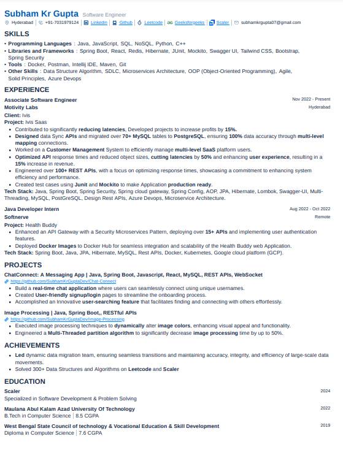

# Hey🙋‍♂️ Thanks for visit

 

# 💫 About Me:

## My name is Subham. I'm a Full Stack Software Engineer. I have knowledge of Java, Spring boot, microservice architecture, HTML, CSS, bootstrap, docker, react, redux, and AWS to deliver high-quality that drives success. I enjoy solving problems and always try to optimize and learn new technologies. Try to improve Everyday 1%.

 

# Greetings

WELCOME TO MY GITHUB REPOSITORY
 
👉 DON'T FORGET TO FOLLOW ME 👈

# 🌐 Socials:

            

# 💻 Tech Stack:

   
                                     

# 📄 Resume

# 🧑‍💻 Leetcode

# 📊 GitHub Stats:

# 🏆 GitHub Trophies

# 🏆 Certificates

### Scaler Certificates

---

### Udemy Certificates

---

### HackerRank Certificates

---

### Coursera Certificates

